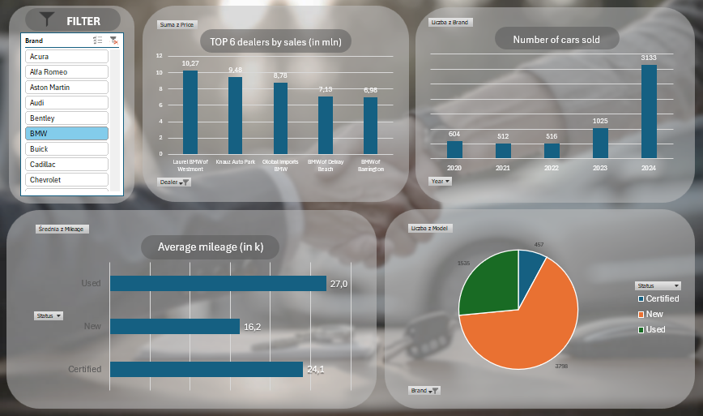

## Small project name: Car Sales Analysis for the years 2020 - 2024.
### By: Amelia Zagórowska

## Project description: 
Car sales analysis in Microsoft Excel with pivot tables, charts and a final report, preceded by data preparation in Python.

## Tools:
1. Python (data cleaning)
3. Microsoft Excel (Power Query, Pivot Tables, Charts, VBA)

## Files:
- cars.csv (raw data)
- cleaning_dataset.ipynb
- cleaned_cars.csv (data prepared for further analysis in M. Excel)
- graphic.jpg (photo used in report)
- DASHBOARD.xlsm (M.Excel file with final report)
- dashboard.png (appearence of interactive report)

## Dashboard preview:

  
## Data sources:
- https://www.kaggle.com/datasets/juanmerinobermejo/us-sales-cars-dataset (raw data for analysis: cars.csv)
- https://pl.pinterest.com/pin/318489004916552088/ (background of the dashboard: graphic.jpg)
